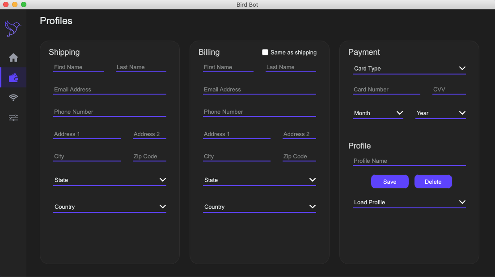

# Profiles Page

The profiles page is where you can set up profiles. Profiles are used by the bot to checkout. 

To setup a profile, fill out all your information in the shipping, billing, and payment fields. Choose a name for your profile and type it in the profile name box. Then click save to save the profile

If you would like to edit a profile, go to the load profile box in the bottom right and select the profile. Make changes and then click save.