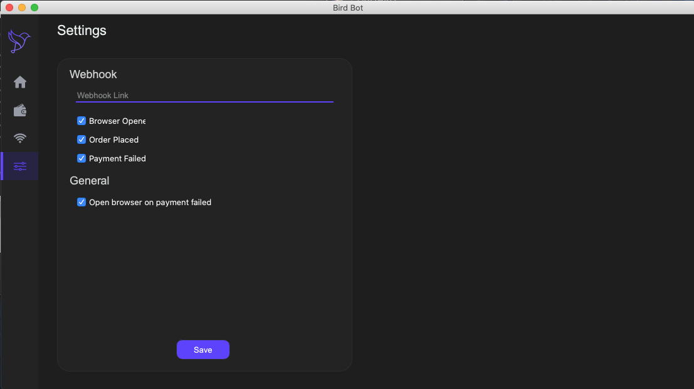
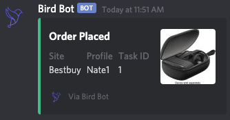

# Settings Page

The settings page is where you set up the settings for the bot

Webhook - This is where you can input a Discord webhook link. A webhook allows you to get notifications about the bot. To learn more about webhooks, click [here](https://support.discordapp.com/hc/en-us/articles/228383668-Intro-to-Webhooks).

Checkboxes - The first 3 checkboxes allow you to configure what messages the bot sends to your webhook. The last one allows you to enable or disable a browser opening when you get a failure at checkout. Read more about this here​

To save your settings, click the save button at the bottom.