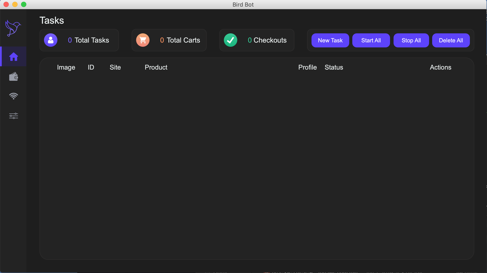
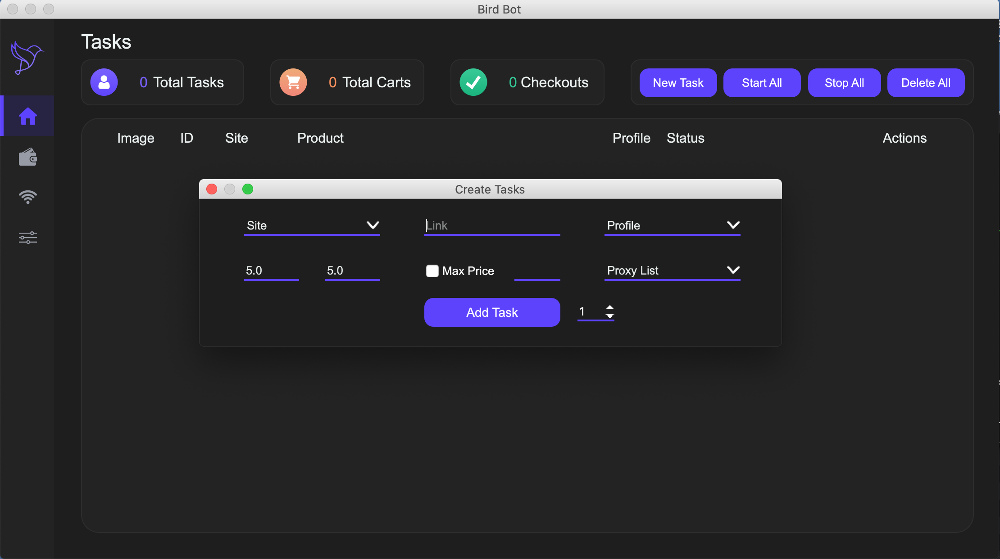
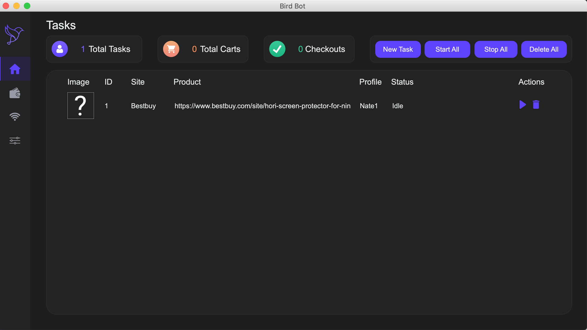

# Tasks Page

The tasks page is where you can set up tasks. Each task allows you to checkout an item of your choice

## Adding tasks

To add tasks, click the new task button. You will then see a pop-up window appear

Site - choose the site you want to run for. The bot supports Walmart and Bestbuy

Link - input the link of the product you want to run for. Not sure what links you want to run? Check the #links-to-run section of the Discord​

Profile - Choose the profile you want to use. Make sure you set these up in the profiles page.

The 5.0 and 5.0 numbers in the bottom left represent the monitor and error delay. These are the time in seconds that the bot sleeps before checking for a restock or waiting after an error occurs. It is recommended to leave these at the default 5.0 setting.

Max Price - If you check the box and input a price (ex: 300) the bot will check and make sure the items retail price is less than that price. This only works for Walmart. It only checks retail price

Proxy List - Choose the proxy list you want to use or choose None if you don't want to use proxies. Make sure you set these up in the proxies page.

If you want to make multiple tasks, simply adjust the counter next to the add task button. Then, click the add task button to create the task(s). 

Once you've got a task added, click the play button to start it.