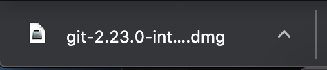
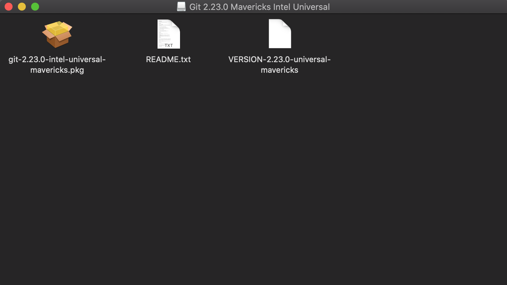
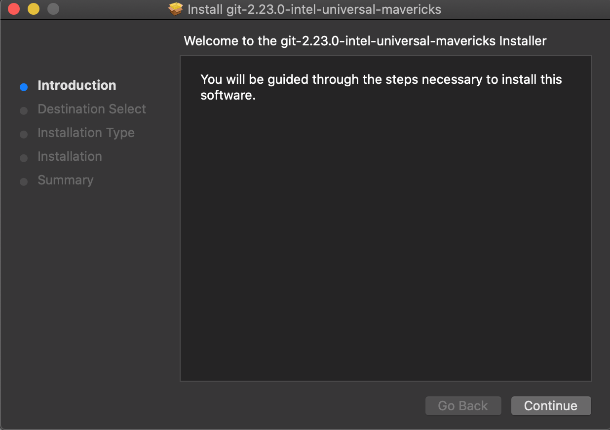
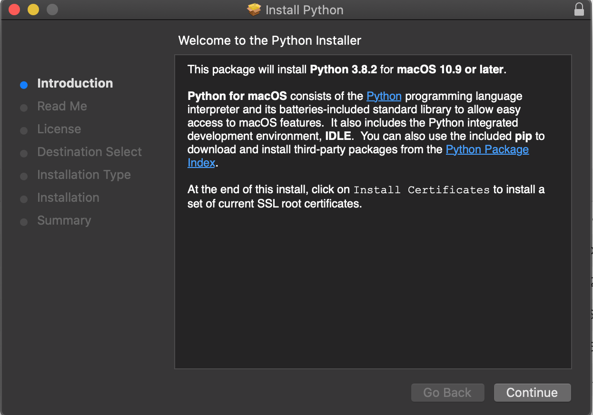
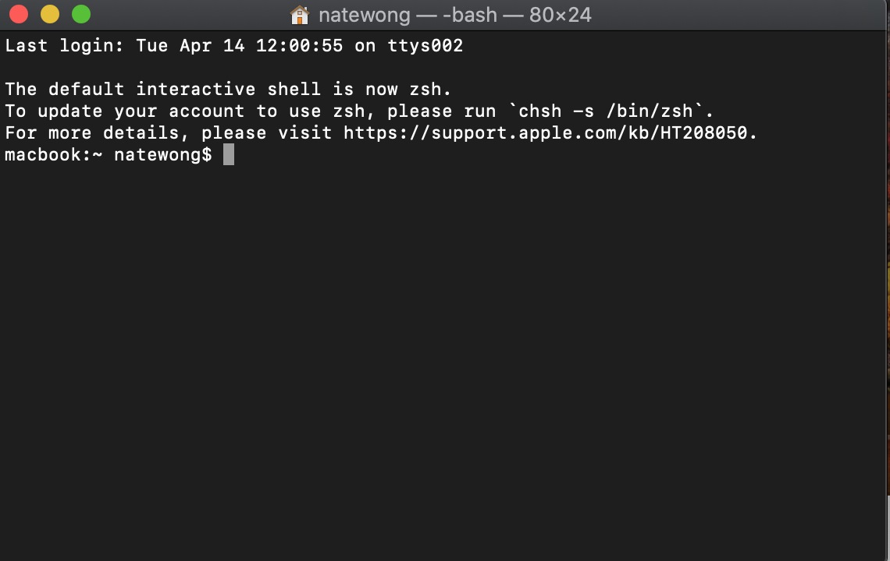

# Mac

How to download Bird Bot on Mac OS
1. Download Git
To download Git, use the installer from here. It should download as a dmg file.

You can also watch a tutorial video here​

Open the dmg and you will see a .pkg file. Double click it. 

If you get a "cannot be opened because it is from an unidentified developer" message when trying to run the .pkg file, go to system preferences -> security and privacy -> and then click "open anyway" at the bottom. If you get stuck, watch a tutorial video [here](https://www.youtube.com/watch?v=yJoSrBe7Tpg).

You will then see an installer pop up. Navigate through the steps until it has finished downloading.

2. Download Python 
To download Python, use the installer from [here](https://www.python.org/ftp/python/3.8.2/python-3.8.2-macosx10.9.pkg). It should download as a .pkg file. Double click it and you will then see an installer pop up. Navigate through the steps until it has finished downloading.

You can also watch a tutorial video [here​](https://www.youtube.com/watch?v=TgA4ObrowRg)

3. Download the bot
To start, open a new terminal window. If you don't know how to open terminal, you can find it by going to search on your mac and typing in "terminal"

Then, type in the following

`cd desktop`  
`git clone https://github.com/natewong1313/bird-bot`  
`cd bird-bot`  

After that, you will need to install the Python modules that help power the bot. To do this, type in the following

`sudo pip3 install -r requirements.txt`  
It may prompt you to enter in your password. Type it and hit enter.

4. Run the bot
To run the bot, simply type 

`python3 app.py`  
After that, the bot should open up. 

If you want to run the bot again, simply run that same command again in the same terminal window. If you exit out of the terminal window and want to run the bot again, open up a new terminal window and run these commands

`cd desktop/bird-bot`  
`python3 app.py`  