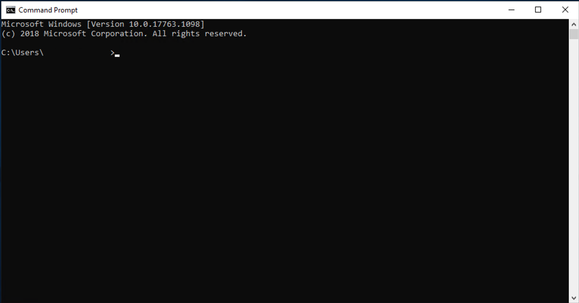

# Windows

How to download Bird Bot on Windows OS
1. Download Git
To download Git, use the installer from [here](https://sourceforge.net/projects/git-osx-installer/). It should download as a exe file.

You can also watch a tutorial video [here](https://www.youtube.com/watch?v=sJ4zr0a4GAs) 

Open the exe and you should see an installer.

Once you get to this step, you can exit out the installer.

2. Download Python
To download Python, use the installer from [here](https://www.python.org/ftp/python/3.8.2/python-3.8.2-amd64.exe). It should download as a .exe file. 

Before running it, PLEASE DO THE FOLLOWING

Find where the installer is located and right click on it. Select "run as administrator"

An installer window will appear. Make sure to click "add python 3.8 to path"

After that, click "install now" to install Python.

3. Download the bot
To start, open a new cmd window. If you don't know how to open cmd, you can find it by going to search and typing in "terminal"

Then, type in the following

`cd desktop`  
`git clone https://github.com/natewong1313/bird-bot`  
`cd bird-bot`  

After that, you will need to install the Python modules that help power the bot. To do this, type in the following

`pip install -r requirements.txt --user`  

You may get this error. If so, run the following command

`pip install pycryptodomex`  

4. Run the bot
To run the bot, simply type

`python app.py`  
After that, the bot should open up. 

If you want to run the bot again, simply run that same command again in the same cmd window. If you exit out of the cmd window and want to run the bot again, open up a new cmd window and run these commands

`cd desktop/bird-bot`  
`python app.py`  